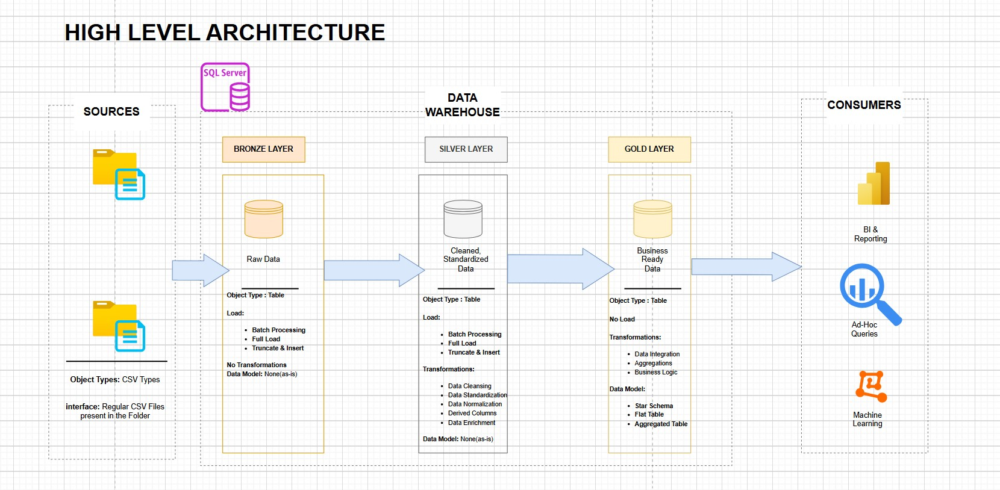
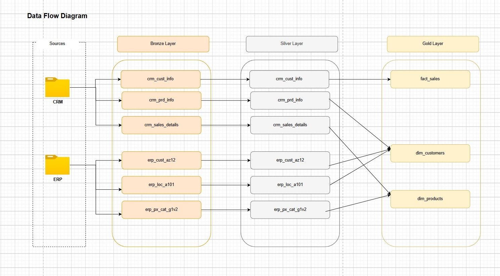
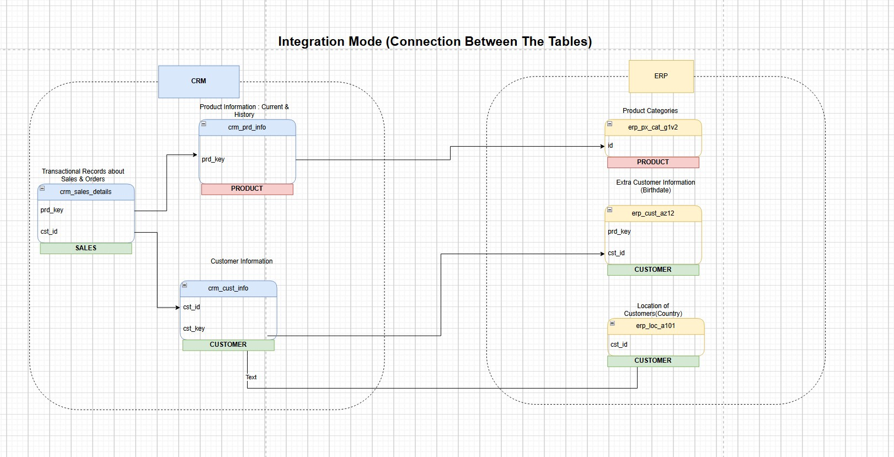
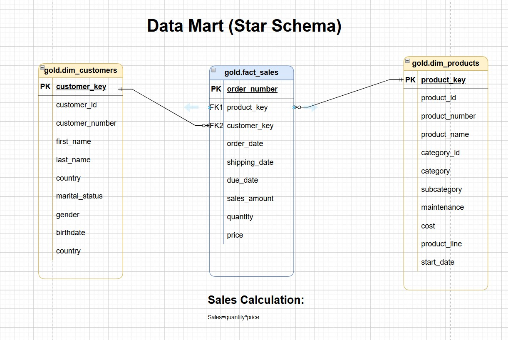

# Data Warehouse Project Architecture and Design

This repository contains the architectural diagrams and data models for a sales analytics data warehouse project. The diagrams illustrate the end-to-end data flow, from source systems to the final consumption layer, following a **medallion architecture** (Bronze, Silver, Gold layers).

---

## High-Level Architecture

The `HighLevel_Arch_Drawio.jpg` diagram provides a broad overview of the data warehouse pipeline. It outlines the three distinct layers:

* **Bronze Layer:** This is the landing zone for raw data from source systems like CRM and ERP. The data is loaded as-is with no transformations.
* **Silver Layer:** In this stage, raw data is cleaned, standardized, and normalized. This is where core data quality and enrichment transformations occur.
* **Gold Layer:** This is the final, business-ready layer. Data is organized into a **star schema** for easy consumption by business intelligence (BI) tools, reporting dashboards, and machine learning models.

---

## Data Flow Diagram

The `DataFlow_Drawio.jpg` visualizes the specific flow of data tables through the Bronze, Silver, and Gold layers. It shows how source tables (`crm_cust_info`, `erp_loc_a101`, etc.) are processed and eventually integrated to form the final dimensional and fact tables in the Gold layer (`dim_customers`, `dim_products`, `fact_sales`). This diagram provides a clear lineage of the data.

---

## Source System Integration Mode

The `IntegrationMode_Drawio.jpg` diagram details the relationships between the tables in the source systems (CRM and ERP). It shows how different entities like **Customer**, **Product**, and **Sales** are linked. This is crucial for understanding how to join and consolidate data from multiple sources during the data integration process.

---

## Data Mart (Star Schema)

The `DataMart_Drawio.jpg` diagram represents the final data model in the Gold layer. It's a classic **star schema** featuring:

* **`gold.fact_sales`**: A central **fact table** that contains the sales transactions, with foreign keys (`product_key`, `customer_key`) linking to the dimensional tables. It also includes measures like `sales_amount`, `quantity`, and `price`.
* **`gold.dim_customers`**: A **dimension table** containing descriptive information about customers.
* **`gold.dim_products`**: A **dimension table** containing descriptive information about products.

The diagram also includes the calculation for `sales_amount`, which is defined as `quantity * price`. This schema is optimized for analytical queries and reporting, enabling fast and intuitive data exploration.
